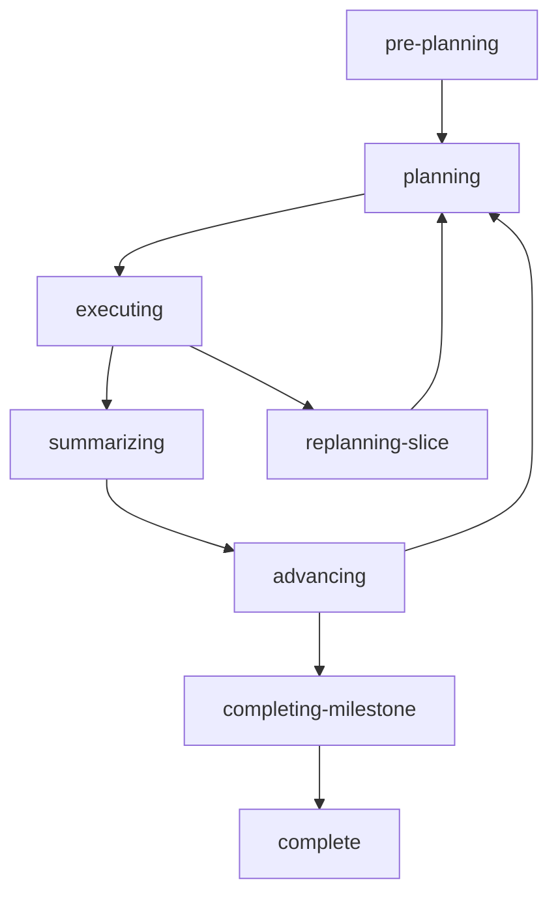

# State Management

GSD's state management is **file-first**: the `.gsd/` directory is the single source of truth. All state is derived by reading files on disk, never cached in memory.

## State Machine Overview

Auto-mode operates as a state machine driven by disk files. After each unit completes, GSD:

1. Reads all files in `.gsd/`
2. Derives the current project state
3. Determines the next unit to dispatch
4. Creates a fresh session via `ctx.newSession()`
5. Injects a focused prompt tailored to the unit type

```typescript src/resources/extensions/gsd/auto.ts
export async function handleAgentEnd(
  ctx: ExtensionContext,
  pi: ExtensionAPI,
): Promise<void> {
  if (!active || !cmdCtx) return

  // Unit completed — clear its timeout
  clearUnitTimeout()

  // Small delay to let files settle (git commits, file writes)
  await new Promise(r => setTimeout(r, 500))

  // Auto-commit any dirty files the LLM left behind
  autoCommitCurrentBranch(basePath, currentUnit.type, currentUnit.id)

  // Post-hook: fix mechanical bookkeeping the LLM may have skipped
  await runGSDDoctor(basePath, { fix: true, scope: doctorScope, fixLevel: "task" })
  await rebuildState(basePath)

  // In step mode, pause and show a wizard
  if (stepMode) {
    await showStepWizard(ctx, pi)
    return
  }

  await dispatchNextUnit(ctx, pi)
}
```

## State Derivation

State is derived by scanning `.gsd/milestones/` and parsing all milestone files:

```typescript src/resources/extensions/gsd/state.ts
export async function deriveState(basePath: string): Promise<GSDState> {
  const milestoneIds = findMilestoneIds(basePath)
  const requirements = parseRequirementCounts(
    await loadFile(resolveGsdRootFile(basePath, "REQUIREMENTS"))
  )

  if (milestoneIds.length === 0) {
    return {
      activeMilestone: null,
      activeSlice: null,
      activeTask: null,
      phase: 'pre-planning',
      // ...
    }
  }

  // Pre-compute complete milestone IDs for dependency checking
  const completeMilestoneIds = new Set<string>()
  for (const mid of milestoneIds) {
    const rf = resolveMilestoneFile(basePath, mid, "ROADMAP")
    const rc = rf ? await loadFile(rf) : null
    if (!rc) {
      const sf = resolveMilestoneFile(basePath, mid, "SUMMARY")
      if (sf) completeMilestoneIds.add(mid)
      continue
    }
    const rmap = parseRoadmap(rc)
    if (!isMilestoneComplete(rmap)) continue
    const sf = resolveMilestoneFile(basePath, mid, "SUMMARY")
    if (sf) completeMilestoneIds.add(mid)
  }

  // Build registry and locate active milestone in a single pass
  const registry: MilestoneRegistryEntry[] = []
  let activeMilestone: ActiveRef | null = null
  let activeRoadmap: Roadmap | null = null

  for (const mid of milestoneIds) {
    const roadmapFile = resolveMilestoneFile(basePath, mid, "ROADMAP")
    const content = roadmapFile ? await loadFile(roadmapFile) : null
    // ... parse and determine status
  }

  return { activeMilestone, activeSlice, activeTask, phase, /* ... */ }
}
```

### Milestone Registry

The registry tracks all milestones and their statuses:

```typescript
export interface MilestoneRegistryEntry {
  id: string              // e.g. "M001"
  title: string           // e.g. "Payment Integrations"
  status: 'pending' | 'active' | 'complete'
  dependsOn?: string[]    // e.g. ["M002", "M003"]
}
```

**Status transitions:**
- `pending` — Not yet started, or dependencies not met
- `active` — Currently being worked on (only one active milestone at a time)
- `complete` — All slices done and summary written

### Dependency Resolution

GSD supports milestone-level dependencies via the `dependsOn` frontmatter field in `CONTEXT.md`:

```markdown
---
dependsOn:
  - M002
  - M003
---
```

The dependency resolver:
1. Pre-computes all complete milestone IDs
2. Checks dependencies before promoting a milestone to `active`
3. Skips milestones with unmet dependencies
4. Allows forward references (M001 depending on M003 works if M003 is complete)

## Phase Detection

GSD detects the current phase by examining the active milestone, slice, and task:

```typescript
export type Phase = 
  | 'pre-planning'        // No roadmap yet
  | 'discussing'          // User interaction needed
  | 'researching'         // Background research underway
  | 'planning'            // Slice needs plan
  | 'executing'           // Task execution
  | 'verifying'           // UAT execution
  | 'summarizing'         // Complete-slice
  | 'advancing'           // Reassess roadmap
  | 'completing-milestone'// Write milestone summary
  | 'replanning-slice'    // Blocker discovered
  | 'complete'            // All done
  | 'paused'              // Auto-mode paused
  | 'blocked'             // Manual intervention required
```

### Phase Transitions

The state machine enforces a strict order:



**Phase-first dispatch:**

Some phases MUST run before others can proceed:

```typescript src/resources/extensions/gsd/auto.ts
if (state.phase === "summarizing") {
  // complete-slice MUST run before reassessment
  unitType = "complete-slice"
  unitId = `${mid}/${sid}`
  prompt = await buildCompleteSlicePrompt(mid, midTitle!, sid, sTitle, basePath)
} else {
  const needsReassess = await checkNeedsReassessment(basePath, mid, state)
  if (needsReassess) {
    unitType = "reassess-roadmap"
    unitId = `${mid}/${needsReassess.sliceId}`
    prompt = await buildReassessRoadmapPrompt(mid, midTitle!, needsReassess.sliceId, basePath)
  }
}
```

The `complete-slice` unit is responsible for calling `mergeSliceToMain()`. Reassessment must wait until the merge is done, otherwise it reads stale state from the slice branch.

## Unit Types

GSD dispatches work as discrete units. Each unit type produces a specific artifact:

| Unit Type | Produces | Example |
|-----------|----------|--------|
| `research-milestone` | `RESEARCH.md` | Scan docs, APIs, existing code |
| `plan-milestone` | `ROADMAP.md` | Decompose into slices |
| `research-slice` | `S0X-RESEARCH.md` | Slice-specific research |
| `plan-slice` | `S0X-PLAN.md` | Decompose into tasks |
| `execute-task` | `S0X/T0Y-SUMMARY.md` | Execute a single task |
| `complete-slice` | `S0X-SUMMARY.md` + merge to main | Write summary, run UAT, merge |
| `reassess-roadmap` | Updated `ROADMAP.md` | Adjust remaining slices based on learnings |
| `run-uat` | `S0X-UAT-RESULT.md` | Execute user acceptance test |
| `complete-milestone` | `SUMMARY.md` | Write milestone summary |

### Unit Idempotency

Completed units are tracked in `.gsd/completed-units.json` to prevent re-dispatch after a crash:

```typescript src/resources/extensions/gsd/auto.ts
const idempotencyKey = `${unitType}/${unitId}`
if (completedKeySet.has(idempotencyKey)) {
  // Cross-validate: does the expected artifact actually exist?
  const artifactExists = verifyExpectedArtifact(unitType, unitId, basePath)
  if (artifactExists) {
    ctx.ui.notify(
      `Skipping ${unitType} ${unitId} — already completed in a prior session.`,
      "info",
    )
    await dispatchNextUnit(ctx, pi)
    return
  } else {
    // Stale completion record — artifact missing. Remove and re-run.
    completedKeySet.delete(idempotencyKey)
    removePersistedKey(basePath, idempotencyKey)
  }
}
```

## Stuck Detection

GSD detects loops where the same unit is dispatched multiple times without producing its expected artifact:

```typescript src/resources/extensions/gsd/auto.ts
const MAX_UNIT_DISPATCHES = 3
const unitDispatchCount = new Map<string, number>()

const dispatchKey = `${unitType}/${unitId}`
const prevCount = unitDispatchCount.get(dispatchKey) ?? 0
if (prevCount >= MAX_UNIT_DISPATCHES) {
  const expected = diagnoseExpectedArtifact(unitType, unitId, basePath)
  await stopAuto(ctx, pi)
  ctx.ui.notify(
    `Loop detected: ${unitType} ${unitId} dispatched ${prevCount + 1} times total.\n` +
    `Expected artifact not found.${expected ? `\n   Expected: ${expected}` : ""}\n` +
    `Check branch state and .gsd/ artifacts.`,
    "error",
  )
  return
}
unitDispatchCount.set(dispatchKey, prevCount + 1)
```

This catches both consecutive retries (A→A→A) and oscillation patterns (A→B→A→B).

## Self-Healing

GSD runs a self-heal routine on auto-mode start to clear stale runtime records:

```typescript src/resources/extensions/gsd/auto.ts
async function selfHealRuntimeRecords(base: string, ctx: ExtensionContext): Promise<void> {
  try {
    const { listUnitRuntimeRecords } = await import("./unit-runtime.js")
    const records = listUnitRuntimeRecords(base)
    let healed = 0
    for (const record of records) {
      const { unitType, unitId } = record
      const artifactPath = resolveExpectedArtifactPath(unitType, unitId, base)
      if (artifactPath && existsSync(artifactPath)) {
        // Artifact exists — unit completed but closeout didn't finish.
        clearUnitRuntimeRecord(base, unitType, unitId)
        healed++
      }
    }
    if (healed > 0) {
      ctx.ui.notify(
        `Self-heal: cleared ${healed} stale runtime record(s) with completed artifacts.`,
        "info"
      )
    }
  } catch {
    // Non-fatal — self-heal should never block auto-mode start
  }
}
```

This repairs incomplete closeouts from prior crashes, preventing spurious re-dispatch of already-completed units.

## STATE.md

The `STATE.md` file is a **derived artifact** — it's always rebuilt from disk state and never read as input:

```typescript
export async function rebuildState(basePath: string): Promise<void> {
  const state = await deriveState(basePath)
  const formatted = formatState(state)
  const statePath = resolveGsdRootFile(basePath, "STATE")
  if (statePath) {
    writeFileSync(statePath, formatted, "utf-8")
  }
}
```

This ensures `STATE.md` is always consistent with the actual files in `.gsd/`, even if the user manually edits other files.

## Next Steps

<CardGroup cols={2}>
  <Card title="Crash Recovery" icon="life-ring" href="/advanced/crash-recovery">
    Understand crash detection and session forensics
  </Card>
  <Card title="Skill Discovery" icon="magnifying-glass" href="/advanced/skill-discovery">
    Learn how auto-mode detects newly installed skills
  </Card>
</CardGroup>
