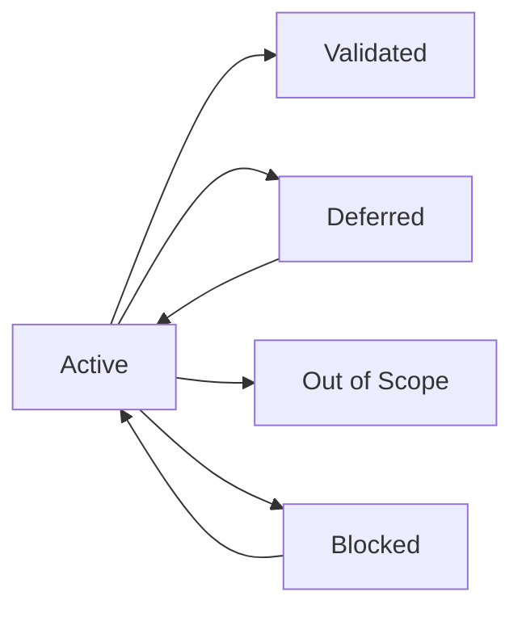

## Overview

The root `.gsd/` directory contains three primary project-level files that define the project vision, track decisions, and manage requirements.

## PROJECT.md

Defines the project vision, tech stack, and initial requirements. Created during `gsd init`.

### Structure

```markdown
# Project Name

**Vision:** Brief project vision statement

**Tech Stack:**
- Framework/runtime
- Key dependencies
- Tools and services

## Success Criteria

- Measurable success criterion 1
- Measurable success criterion 2
- Measurable success criterion 3

## Initial Requirements

- Core requirement 1
- Core requirement 2
- Core requirement 3
```

### Fields

<ParamField path="Vision" type="string">
  One-sentence statement of what the project aims to achieve
</ParamField>

<ParamField path="Tech Stack" type="list">
  Bulleted list of frameworks, languages, and key dependencies
</ParamField>

<ParamField path="Success Criteria" type="list">
  Measurable outcomes that define project completion
</ParamField>

<ParamField path="Initial Requirements" type="list">
  Core features and capabilities the project must deliver
</ParamField>

### Example

```markdown
# Task Management API

**Vision:** A REST API for managing tasks with authentication and real-time updates

**Tech Stack:**
- Node.js 20+ with TypeScript
- Express.js for REST API
- PostgreSQL for data persistence
- Socket.io for real-time updates
- Jest for testing

## Success Criteria

- Users can create, read, update, and delete tasks
- Real-time task updates across connected clients
- Authentication with JWT tokens
- 95%+ test coverage
- API response time under 200ms

## Initial Requirements

- User registration and authentication
- CRUD operations for tasks
- Real-time task synchronization
- Task filtering and search
- RESTful API with OpenAPI documentation
```

<Tip>
  Keep the vision statement concise. This becomes the north star for all planning decisions.
</Tip>

## DECISIONS.md

Chronological log of engineering decisions with full context and rationale.

### Structure

Each decision is a level-2 heading with timestamp:

```markdown
# Engineering Decisions

## 2026-03-13: Decision Title

**Context:** What circumstances led to this decision

**Decision:** What was decided

**Rationale:** Why this approach was chosen

**Alternatives considered:** Other options that were evaluated

**Consequences:** Known trade-offs and implications

---

## 2026-03-12: Previous Decision

...
```

### Fields

<ParamField path="Date" type="string" required>
  ISO date (YYYY-MM-DD) in the heading
</ParamField>

<ParamField path="Title" type="string" required>
  Brief description of what was decided
</ParamField>

<ParamField path="Context" type="string" required>
  Background: what problem or question prompted this decision
</ParamField>

<ParamField path="Decision" type="string" required>
  Clear statement of what was decided
</ParamField>

<ParamField path="Rationale" type="string" required>
  Why this decision makes sense given the context
</ParamField>

<ParamField path="Alternatives considered" type="string">
  Other approaches that were evaluated
</ParamField>

<ParamField path="Consequences" type="string">
  Known trade-offs, technical debt, or follow-up work
</ParamField>

### Example

```markdown
## 2026-03-13: Use PostgreSQL instead of MongoDB

**Context:** Need persistent storage for tasks with complex querying requirements including filtering by date ranges, user assignments, and tag combinations.

**Decision:** Use PostgreSQL 15+ with full-text search for task storage

**Rationale:**
- Task data has clear relational structure (users, tasks, tags)
- Need ACID guarantees for task assignments
- Full-text search built into Postgres eliminates need for external search service
- Team has more PostgreSQL experience than MongoDB

**Alternatives considered:**
- **MongoDB**: Better for document-heavy data, but task structure is relational
- **SQLite**: Simpler deployment, but limited concurrent write performance
- **MySQL**: Viable alternative, but Postgres full-text search is superior

**Consequences:**
- Requires PostgreSQL in production environment
- Need to set up database migrations (using node-pg-migrate)
- Slightly more complex local development setup
```

<Note>
  Decisions should be immutable. If a decision changes, add a new entry referencing the old one.
</Note>

## REQUIREMENTS.md

Structured requirements document organized by status with requirement IDs.

### Structure

```markdown
# Requirements

## Active

### REQ001 — User Authentication

**Description:** Users can register, log in, and manage their accounts

**Acceptance criteria:**
- User registration with email validation
- Login with email and password
- JWT token generation and validation
- Password reset flow

**Status:** active

---

## Validated

### REQ002 — Task CRUD Operations

**Description:** Complete create/read/update/delete for tasks

**Acceptance criteria:**
- Create task with title, description, due date
- Retrieve single task or list of tasks
- Update task fields
- Delete tasks (soft delete)

**Status:** validated
**Completed in:** M001/S02

---

## Deferred

### REQ003 — Task Attachments

**Description:** Users can attach files to tasks

**Status:** deferred
**Reason:** Requires file storage infrastructure (S3/similar)
**Target:** M003

---

## Out of Scope

### REQ004 — Mobile App

**Description:** Native iOS and Android applications

**Status:** out_of_scope
**Reason:** Project scope limited to API. Mobile apps are separate projects.
```

### Requirement Format

<ParamField path="ID" type="string" required>
  Unique requirement ID (REQ001, REQ002, etc.)
</ParamField>

<ParamField path="Title" type="string" required>
  Brief, clear description of the requirement
</ParamField>

<ParamField path="Description" type="string" required>
  Detailed explanation of what is needed
</ParamField>

<ParamField path="Acceptance criteria" type="list" required>
  Bulleted list of testable conditions for completion
</ParamField>

<ParamField path="Status" type="enum" required>
  One of: `active`, `validated`, `deferred`, `out_of_scope`, `blocked`
</ParamField>

<ParamField path="Completed in" type="string">
  Milestone and slice where requirement was implemented (for validated requirements)
</ParamField>

<ParamField path="Reason" type="string">
  Explanation for deferred or out-of-scope status
</ParamField>

<ParamField path="Target" type="string">
  Target milestone for deferred requirements
</ParamField>

### Status Sections

<ResponseField name="Active" type="section">
  Requirements currently being implemented or planned for the active milestone
</ResponseField>

<ResponseField name="Validated" type="section">
  Requirements that have been implemented and verified
</ResponseField>

<ResponseField name="Deferred" type="section">
  Requirements postponed to future milestones
</ResponseField>

<ResponseField name="Out of Scope" type="section">
  Requirements explicitly excluded from the project
</ResponseField>

<ResponseField name="Blocked" type="section">
  Requirements that cannot proceed due to external dependencies
</ResponseField>

### Requirement Lifecycle

Requirements flow through states as the project progresses:



<Tip>
  Use the `gsd req` command to manage requirements without manual editing
</Tip>

## Editing Guidelines

### PROJECT.md

- **Edit freely** during planning phase
- **Avoid major changes** once execution begins
- Update tech stack as dependencies are added
- Keep success criteria measurable

### DECISIONS.md

- **Append only** — never delete or modify existing entries
- Add new decision immediately after making it
- Include all five sections (context, decision, rationale, alternatives, consequences)
- Reference related decisions by date

### REQUIREMENTS.md

- **Move requirements** between sections as status changes
- **Preserve IDs** — never reuse requirement IDs
- Update status field when moving sections
- Add completion info (milestone/slice) when validating

<Warning>
  Never delete requirements. Move them to "Out of Scope" if no longer relevant.
</Warning>

## Parsing

GSD parses these files using structured markdown parsers:

- **Bold-prefixed fields** (`**Vision:**`) extracted via regex
- **Sections** extracted by heading level
- **Bullet lists** parsed and dedented
- **Requirements** identified by `### REQ\d+` pattern

See `/api/gsd-directory` for parser implementation details.

## Related

<CardGroup cols={2}>
  <Card title=".gsd/ Directory" icon="folder-tree" href="/api/gsd-directory">
    Overview of the complete directory structure
  </Card>
  <Card title="State Files" icon="database" href="/api/state-files">
    STATE.md and runtime state tracking
  </Card>
</CardGroup>
